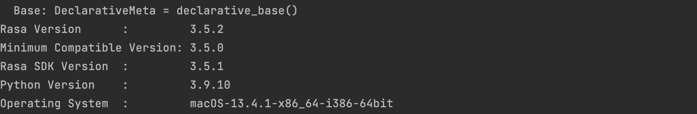
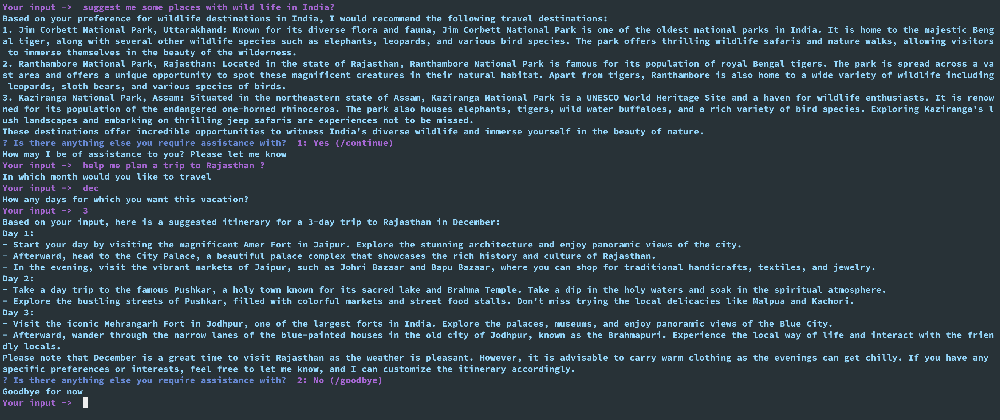
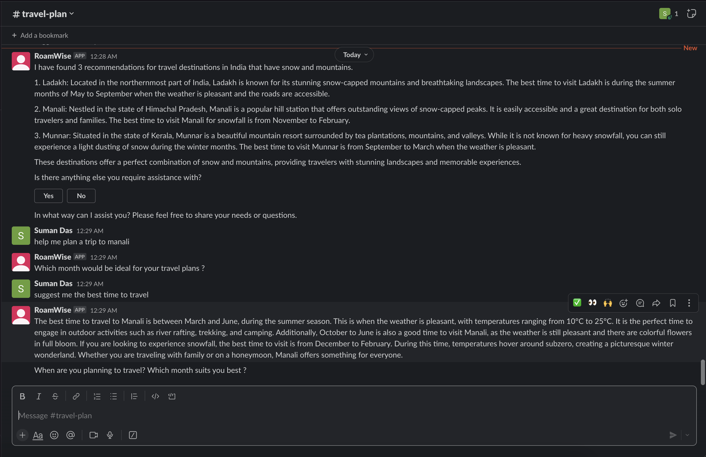

## RoamWise Travel Planner
Introducing RoamWise, the revolutionary travel planner app powered by cutting-edge generative AI technology.


RoamWise is a travel planning application designed to enhance your exploration and make your journeys more seamless. With RoamWise, you can unlock the full potential of your travels by providing intelligent recommendations, comprehensive itineraries, and convenient travel management tools.

Discover new destinations and hidden gems tailored to your preferences, interests, and travel style. RoamWise combines advanced algorithms with curated travel content to offer personalized recommendations that suit your individual tastes. Whether you're an adventure seeker, a food enthusiast, a history buff, or simply looking to unwind, RoamWise ensures your travel experiences align with your desires.

Key features RoamWise include:
* **Destination Recommendation**: Users can discover perfect travel destination based on their preferences and interests.
* **Itinerary Creation**: Users can create detailed itineraries by inputting their destination, travel dates, and duration of the trip.
* **Context based Recommendation**: Users will get personalized travel recommendations tailored to their specific context and preferences.
* **Hotel Recommendation**: Get hotel recommendation based on budget or some other preference.

Overall, the travel planner app aims to simplify the process of itinerary creation, enhance travel organization, and provide users with a seamless and enjoyable travel planning experience.

**Video demonstration (click the picture):**

[](https://youtu.be/P30QUiCsvRI)

### Built With

- [Rasa : 3.5.2 ](https://rasa.com/docs/rasa/)
- [Python : 3.9 ](https://www.python.org/)
- [Rasa-SDK Action Server : 3.5.1 ](https://rasa.com/docs/action-server)
- [RASA-X :1.0.0](https://rasa.com/docs/rasa-x/)
- [LangChain](https://python.langchain.com/docs/get_started/introduction.html)
- [ChatGPT](https://openai.com/blog/chatgpt)



## Getting Started

### Prerequisites

- Python
- [Pipenv](https://pypi.org/project/pipenv/)
- [Docker](https://docs.docker.com/engine/install/)
- [Helm](https://helm.sh/docs/intro/install/)
- [Kubernetes](https://kubernetes.io/docs/setup/)
- [OPEN_API_KEY](https://help.openai.com/en/articles/4936850-where-do-i-find-my-secret-api-key)


### Installation

- Clone the repository

  ```
  git clone https://github.com/sumanentc/travel-planner.git
  ```

- Using RASA Shell and Stand-alone Action Server

1. Install dependencies

  ```
  pipenv shell

  pipenv install
  ```

2. Train the model

  ```
  rasa train --force

  ```

3. Start the Action Server

  ```
  export OPENAI_API_KEY="valid api key"     
  rasa run actions

  ```

4. Start the RASA shell

  ```
  rasa shell 
  ```
5. Start asking questions on the RASA shell



- Using Docker Compose for Installation
  **Note** : Here I am using my personal docker hub account to store the image: **sumand**


1. Build and push RASA Action Server Docker image

```commandline
docker build actions/ -t sumand/rasa-action-server:3.5.1

docker push sumand/rasa-action-server:3.5.1

```

2. Build and push Rasa NLU Docker image

```commandline
docker build . -t sumand/rasa-server:3.5.2

docker push sumand/rasa-server:3.5.2
```

3. Start the NLU Container

```commandline
OPENAI_API_KEY='valid api key' docker-compose up

```

4. Test the Bot using REST API

```buildoutcfg
curl -X POST localhost:5005/webhooks/rest/webhook -d '{"sender":"Me","message":"Suggest me some places with mountain and snow in India"}'

```

- Slack Integration

Follow the steps mentioned in the below wiki to integrate with Slack channel.

[Slack-Integration](https://rasa.com/docs/rasa/connectors/slack/)



## License

Distributed under the MIT License. See `LICENSE` for more information.

## References

https://rasa.com/docs/rasa-enterprise/1.0.x/installation-and-setup/install/rasa-ephemeral-installer/configuration/#:~:text=By%20default%2C%20the%20password%20for,read%20the%20password%20from%20STDIN%20.

https://python.langchain.com/docs/get_started/introduction.html

https://platform.openai.com/docs/models


